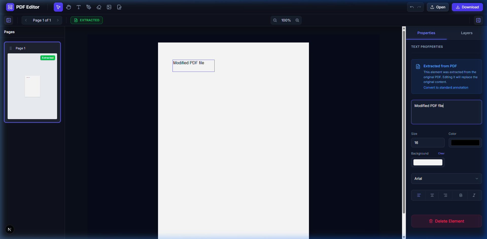

# Advanced WYSIWYG PDF Editor

An interactive, premium-designed, web-based PDF Editor that allows users to modify text, draw annotations, place images/watermarks, and organize PDF documents (reorder, rotate, delete pages) with perfect canvas coordinate synchronization.



## Core Features

- **WYSIWYG Text Editing (Extraction & Reflow)**
  - Fully extract a page's text layer using PDF.js and convert it into editable, positionable text area overlays.
  - Interactive click-to-extract text: Click directly on any text segment in the document to select, edit, or drag it.
  - **No Double Text Bug**: Implements a coordinates-based background mask system that places white mask patches at the original coordinates of the extracted text, preventing duplicate or overlapping characters from showing underneath when text is edited or repositioned.
- **Image & Watermark Overlays**
  - Drag and drop or upload image overlays onto any page.
  - Scale image width (size) dynamically via range sliders.
  - Adjust image opacity down to 10% to apply professional watermarks.
- **Signature & Ink Drawing**
  - Draw annotations or sign documents directly using the Pen tool.
  - Signature Modal with dark UI theme supporting drawing, typing (custom fonts), and image uploads.
  - Adjust stroke/brush thickness (size), opacity, and hex color values in real-time.
- **Advanced Shapes Tool**
  - Unified Shape Picker allowing users to select and draw various shapes.
  - Supported shapes include: Rectangle, Circle/Ellipse, Triangle, Star, Diamond, Straight Line, and Arrow.
- **Improved Workspace Controls**
  - Free movement for all elements: easily drag text, images, shapes, signatures, and stamps across the canvas.
  - Easily delete any hovered or selected element with a quick inline delete button (✕).
  - Global Keyboard Shortcuts support: `Ctrl+Z` (Undo), `Ctrl+Y` (Redo), `Delete`/`Backspace` (Delete element), and tool-specific hotkeys (e.g., `V`, `T`, `P`, `E`).
- **Visual Document Page Organizer**
  - View full-page thumbnails in the left sidebar.
  - Drag-and-drop page items to reorder pages.
  - Rotate pages in 90-degree increments natively (all drawing/text annotation coordinates are automatically projected onto the rotated canvas space).
  - Delete individual pages cleanly.
- **Loading & Drag-and-Drop**
  - Drag and drop local PDF files anywhere on the empty workspace to load them.
  - Load any public PDF URL directly. Includes a backend Node/Express CORS proxy to bypass cross-origin resource limitations.
- **Perfect PDF Exports**
  - Synthesize and compile all modifications back into a standard, downloadable PDF document using `pdf-lib`.

---

## Tech Stack

### Frontend
- **Framework**: React 19, Next.js (Turbopack)
- **State Management**: Redux Toolkit (for full undo/redo action history, tab switches, scale, active tool, and annotation state)
- **Styling**: Tailwind CSS & Custom CSS variables
- **PDF Rendering**: `react-pdf` & `pdfjs-dist` (utilizes unpkg CDN for the worker to guarantee cross-environment Next.js compilation)
- **PDF Compilation**: `pdf-lib` (handles copy-pages, rotate-page, drawText with custom wrapping, drawRectangle masking, and drawImage operations)

### Backend
- **Server**: Node.js, Express.js, TypeScript (CORS proxy routing to stream external PDF files directly to the editor canvas)

---

## Running Guide

Ensure you have [Node.js](https://nodejs.org/) installed.

### 1. Run the Backend Server
The backend is required to proxy external PDF URLs and bypass CORS errors.

```bash
cd backend
npm install
npm run dev
```
The backend server will run on `http://localhost:3001`.

### 2. Run the Frontend Editor

```bash
cd frontend
npm install
npm run dev
```
The frontend editor will run on `http://localhost:3000`. Open your browser to `http://localhost:3000/editor` to start editing documents.

---

## Technical Details

### 1. The Double Text Masking Solution
Standard browser PDF renders display the PDF text directly onto the visual `<canvas>` layer. When you modify or drag extracted overlay text:
1. The canvas pixels underneath remain static and continue displaying the original text.
2. The user sees both the old text (on the canvas) and the new text (on the overlay) overlapping.

**Our Fix**: Every text annotation stores its initial `maskX`, `maskY`, `maskWidth`, and `maskHeight` coordinates.
- **UI Render**: We overlay a solid white background `div` at the original coordinates, covering the canvas text.
- **PDF Generator**: When downloading the PDF, we draw a solid white rectangle (`pdf-lib`'s `drawRectangle`) over the original coordinates before placing the modified text at its new location.
- **Element Deletion**: If an annotation is deleted, the text disappears, but we retain the white mask to keep the original text redacted/erased.

### 2. Rotated Canvas Projection
When a page is rotated by 90/180/270 degrees in the browser, the coordinates of the annotation overlays are automatically translated using:
- Visual relative wrapping inside the `<Page>` component child hierarchy.
- A custom un-rotation coordinate translation algorithm in the PDF compiler (`pdfGenerator.ts`) to ensure signatures, text, and images appear in their exact visual positions on rotated physical pages when downloaded.
